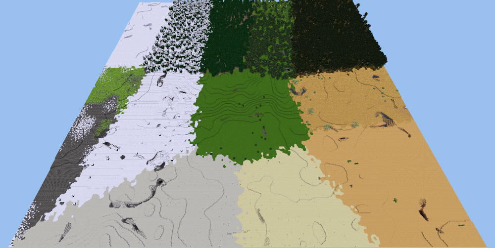
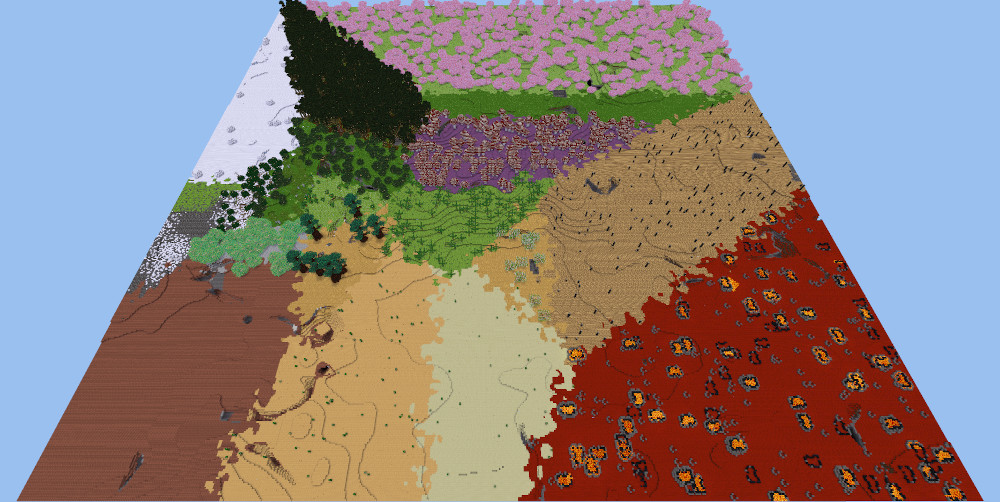

#Voronoi Biomes Patch

##Place biomes to match their Voronoi diagram

This is a patch for minetest that allows creating worlds with biomes
arranged in the standard Voronoi pattern. Heat (or temperature) on the x-axis and humidity
on the z-axis.

**This is a proof of concept that is intended for people who are experienced compiling minetest themselves.**

** Cautions **

- Once this patch is applied, there is no way to set it back to normal functionality without reverting the patch and recompiling.
- Therefore, make this change to a separate copy of minetest, and use the `RUN_IN_PLACE` option to keep this version's files completely separate from your regular minetest version.

**Compile minetest with this patch**

- Download minetest source code to new directory and compile regularly. I used commit dde0628976… from Oct 5, 2019.
- Patch `src/mapgen/mg_biome.cpp` with included patch file, and recompile.  In Linux you can use something like:
>       patch mg_biome.cpp /path/to/voronoi_biomes.patch

**Source code options**

- By default the patch creates Voronoi maps with sides of 500 nodes.
- It maps x=-250 to heat=0 and x=+250 to heat=100. The corresponding values for humidity are mapped from z=-250 to z=+250.
- This can be changed by updating the following value in the patched version of mg_biome.cpp before recompiling:
>       #define W_Voronoi 500

**Further customizations can be done in minetest.conf:**

- Biomes are still blended, but this can be disabled or reduced by changing the values of `mg_biome_np_heat_blend` and `mg_biome_np_humidity_blend`.
- To get a small world like shown in the screenshot above, I set `mapgen_limit = 300`.

It's more difficult when the biomes change with elevation.

- Multiple runs can be done with different base levels—carpathian and flat mapgens have easy options to do this.
- Otherwise, use different mapgens and seeds to find what works. I've used amidst-minetest, but keep in mind that the biomes that program shows will be completely overridden.

**License of source code:  LGPL-2.1**

This library is free software; you can redistribute it and/or modify it under the terms of the GNU Lesser General Public License as published by the Free Software Foundation; either version 2.1 of the License, or (at your option) any later version.

This library is distributed in the hope that it will be useful, but WITHOUT ANY WARRANTY; without even the implied warranty of MERCHANTABILITY or FITNESS FOR A PARTICULAR PURPOSE. See the GNU Lesser General Public License for more details.

You should have received a copy of the GNU Lesser General Public License along with this library; if not, write to the Free Software Foundation, Inc., 51 Franklin Street, Fifth Floor, Boston, MA 02110-1301 USA

**License of media (images):  CC-BY-SA-4.0**

This work is licensed under the Creative Commons Attribution-ShareAlike 4.0 International License. To view a copy of this license, visit http://creativecommons.org/licenses/by-sa/4.0/ or send a letter to Creative Commons, PO Box 1866, Mountain View, CA 94042, USA.
